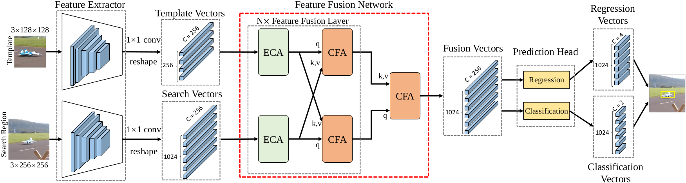
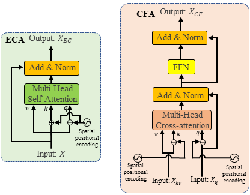

# TransT - Transformer Tracking [CVPR2021]
Official implementation of the TransT (CVPR2021) , including training code and trained models.

## Tracker
#### TransT ####

[**[Paper]**](https://arxiv.org/abs/2103.15436)
[**[Models]**](https://drive.google.com/drive/folders/1GVQV1GoW-ttDJRRqaVAtLUtubtgLhWCE?usp=sharing)

This work
presents a attention-based feature fusion network,
which effectively combines the template and search region
features using attention. Specifically, the proposed
method includes an ego-context augment module based on
self-attention and a cross-feature augment module based on
cross-attention. We present a Transformer tracking 
(named TransT) method based on the Siamese-like feature extraction 
backbone, the designed attention-based fusion mechanism, 
and the classification and regression head.

TransT is a very simple and efficient tracker, 
without online update module, using the same model and hyparameter for all
test sets.




## Results

<table>
  <tr>
    <th>Model</th>
    <th>LaSOT<br>AUC (%)</th>
    <th>TrackingNet<br>AUC (%)</th>
    <th>GOT-10k<br>AO (%)</th>
    <th>OTB100<br>AUC (%)</th>
    <th>NFS<br>AUC (%)</th>
    <th>UAV123<br>AUC (%)</th>
    <th>Speed<br></th>
    <th>Params<br></th>
  </tr>
  <tr>
    <td>TransT-N2</td>
    <td>64.2</td>
    <td>80.9</td>
    <td>69.9</td>
    <td>68.1</td>
    <td>65.7</td>
    <td>67.0</td>
    <td>70fps</td>
    <td>16.7M</td>
  </tr>
  <tr>
    <td>TransT-N4</td>
    <td>64.9</td>
    <td>81.4</td>
    <td>72.3</td>
    <td>69.4</td>
    <td>65.7</td>
    <td>69.1</td>
    <td>50fps</td>
    <td>23.0M</td>
  </tr>
</table>

## Installation
This document contains detailed instructions for installing the necessary dependencied for **TransT**. The instructions 
have been tested on Ubuntu 18.04 system.

#### Install dependencies
* Create and activate a conda environment 
    ```bash
    conda create -n transt python=3.7
    conda activate transt
    ```  
* Install PyTorch
    ```bash
    conda install -c pytorch pytorch=1.5 torchvision=0.6.1 cudatoolkit=10.2
    ```  

* Install other packages
    ```bash
    conda install matplotlib pandas tqdm
    pip install opencv-python tb-nightly visdom scikit-image tikzplotlib gdown
    conda install cython scipy
    sudo apt-get install libturbojpeg
    pip install pycocotools jpeg4py
    pip install wget yacs
    pip install shapely==1.6.4.post2
    ```  
* Setup the environment                                                                                                 
Create the default environment setting files.

    ```bash
    # Change directory to <PATH_of_TransT>
    cd TransT
    
    # Environment settings for pytracking. Saved at pytracking/evaluation/local.py
    python -c "from pytracking.evaluation.environment import create_default_local_file; create_default_local_file()"
    
    # Environment settings for ltr. Saved at ltr/admin/local.py
    python -c "from ltr.admin.environment import create_default_local_file; create_default_local_file()"
    ```
You can modify these files to set the paths to datasets, results paths etc.
* Add the project path to environment variables  
Open ~/.bashrc, and add the following line to the end. Note to change <path_of_TransT> to your real path.
    ```
    export PYTHONPATH=<path_of_TransT>:$PYTHONPATH
    ```
* Download the pre-trained networks   
Download the network for [TransT](https://drive.google.com/drive/folders/1GVQV1GoW-ttDJRRqaVAtLUtubtgLhWCE?usp=sharing)
and put it in the directory set by "network_path" in "pytracking/evaluation/local.py". By default, it is set to 
pytracking/networks.

## Quick Start
#### Traning
* Modify [local.py](ltr/admin/local.py) to set the paths to datasets, results paths etc.
* Runing the following commands to train the TransT. You can customize some parameters by modifying [transt.py](ltr/train_settings/transt/transt.py)
    ```bash
    conda activate transt
    cd TransT/ltr
    python run_training.py transt transt
    ```  

#### Evaluation

* We integrated [PySOT](https://github.com/STVIR/pysot) for evaluation.
    
    You need to specify the path of the model and dataset in the [test.py](pysot_toolkit/test.py).
    ```python
    net_path = '/path_to_model' #Absolute path of the model
    dataset_root= '/path_to_datasets' #Absolute path of the datasets
    ```  
    Then run the following commands.
    ```bash
    conda activate TransT
    cd TransT
    python -u pysot_toolkit/test.py --dataset <name of dataset> --name 'transt' #test tracker #test tracker
    python pysot_toolkit/eval.py --tracker_path results/ --dataset <name of dataset> --num 1 --tracker_prefix 'transt' #eval tracker
    ```  
    The testing results will in the current directory(results/dataset/transt/)
    
* You can also use [pytracking](pytracking) to test and evaluate tracker. 
The results might be slightly different with [PySOT](https://github.com/STVIR/pysot) due to the slight difference in implementation (pytracking saves results as integers, pysot toolkit saves the results as decimals).

## Acknowledgement
This is a modified version of the python framework [PyTracking](https://github.com/visionml/pytracking) based on **Pytorch**, 
also borrowing from [PySOT](https://github.com/STVIR/pysot) and [detr](https://github.com/facebookresearch/detr). 
We would like to thank their authors for providing great frameworks and toolkits.

## Contact
* Xin Chen (email:chenxin3131@mail.dlut.edu.cn)

    Feel free to contact me if you have additional questions. 
